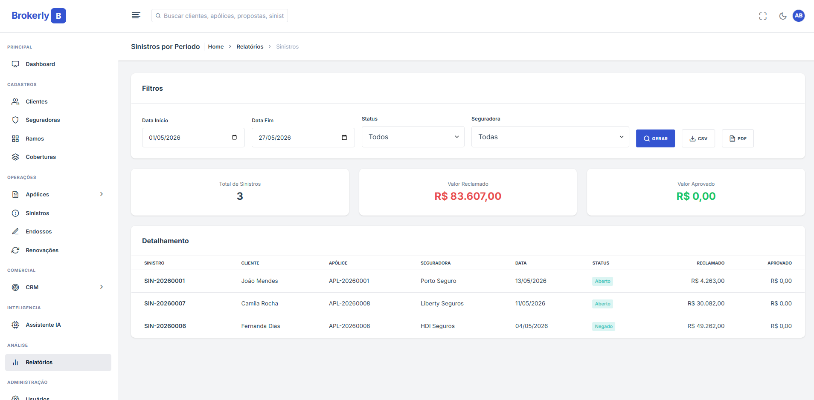

# Brokerly: Multi-Tenant Insurance Brokerage Management System

[](https://www.python.org/)
[](https://www.djangoproject.com/)
[](https://www.postgresql.org/)
[](https://docs.celeryq.dev/)
[](https://openai.com/)

Brokerly is a SaaS platform for Brazilian insurance brokerages. It manages a
brokerage operation end to end: tenants, users, clients, insurers, proposals,
policies, claims, partners, commissions, and protected documents.

The product follows a shared-schema multi-tenant architecture: every sensitive
domain record belongs to a brokerage, and private views are scoped by the
authenticated user's tenant.

> Documentação em português disponível em [README.pt-br.md](README.pt-br.md).

---

## Screenshots


*Admin dashboard: sales funnel, KPIs, monthly production, and portfolio distribution.*

| CRM Kanban | AI Assistant |
|:---:|:---:|
|  |  |
| Drag-and-drop sales pipeline with per-stage totals. | Natural-language queries against the brokerage's own data. |

| Reports | Dark Mode |
|:---:|:---:|
|  |  |
| Filterable reports with CSV and PDF export. | Built-in dark theme across the application. |

---

## Table of Contents

- [Screenshots](#screenshots)
- [Features](#features)
- [Tech Stack](#tech-stack)
- [Project Structure](#project-structure)
- [Getting Started](#getting-started)
- [Roles & Permissions](#roles--permissions)
- [AI Agents](#ai-agents)
- [Product Source of Truth](#product-source-of-truth)

---

## Features

### Core Records

- **Brokerages and subscriptions**: tenant registration with plans and subscription records
- **Users**: custom user model with email login and role-based access
- **Clients**: individuals and companies with contact, address, and document data
- **Insurers**: insurer registration with SUSEP code, contacts, and lines of business
- **Partners**: agents and producers linked to brokerages, users, and commercial hierarchy

### Insurance Operations

- **Proposals**: commercial workflow before policy issuance
- **Policies**: validity periods, premiums, installments, insured items, and protected documents
- **Claims**: claim opening, status tracking, event data, and documentation
- **Endorsements and renewals**: planned domain modules for policy lifecycle management
- **Protected media**: attachments are served through authenticated tenant-aware views

### Commissions

- **Commission records**: generated from policies with premium base, net premium, insurer rate,
  insurer amount, status, and reference dates
- **Splits**: agent and producer payouts with tenant validation and beneficiary constraints
- **Backfill command**: safe repeated generation of missing commissions for existing policies
- **Financial summaries**: aggregate amount and count by commission status for dashboard cards

### Administration & UI

- Django Admin registrations for operational management
- Server-rendered Django Templates
- DuralUX-based design system
- WhiteNoise static file serving
- Portuguese Brazilian labels, validations, and user-facing messages

### AI Agents

- Tenant-scoped LangChain/LangGraph agents
- OpenAI GPT-5.5-mini as the required model
- Entity summaries and chat tools designed to receive brokerage scope from the server
- Background execution planned through Celery tasks

---

## Tech Stack

| Layer | Technology |
|---|---|
| Language | Python 3.13+ |
| Backend | Django 6.0+ |
| Database | PostgreSQL 16 |
| Async jobs | Celery |
| Broker | RabbitMQ 3 |
| Cache / result backend | Redis 7 |
| AI / LLM | LangChain 1.0+, LangGraph, OpenAI GPT-5.5-mini |
| PDF | ReportLab, PyPDF, xhtml2pdf |
| Frontend | Django Templates, Bootstrap, DuralUX design system |
| Static files | WhiteNoise with compressed static files |
| Production | Docker Swarm, Traefik v3, Gunicorn |
| Environment | django-environ |

---

## Project Structure

```text
brokerly/
├── accounts/          # Custom user model, email login, roles, and profile flows
├── base/              # Shared models, mixins, managers, and helpers
├── claims/            # Claims
├── clients/           # Clients, individuals, and companies
├── commissions/       # Commissions and payout splits
├── core/              # Settings, root URLs, Celery, WSGI/ASGI
├── design_system/     # Visual reference and DuralUX assets
├── docs/              # Project documentation
├── documents/         # Protected attachments
├── insurance/         # Proposals, policies, items, installments, endorsements, renewals
├── insurers/          # Insurers and lines of business
├── partners/          # Agents and producers
├── static/            # Custom static assets
├── templates/         # Django templates
├── tenants/           # Brokerages, plans, subscriptions, and tenant middleware
├── manage.py
├── requirements.txt
├── docker-compose.yml
├── docker-stack.yml
└── PRD.md
```

---

## Getting Started

Requires Docker and Docker Compose for the standard local environment.

```bash
git clone https://github.com/yagosamu/brokerly.git
cd brokerly
cp .env.example .env
docker compose up -d --build
docker compose exec app python manage.py migrate
docker compose exec app python manage.py createsuperuser
```

Open `http://localhost:8000` and sign in with the superuser account.

### Useful local commands

```bash
docker compose exec app python manage.py check
docker compose exec app python manage.py makemigrations
docker compose exec app python manage.py migrate
docker compose exec app python manage.py backfill_commissions
```

If you run Django directly on the host, use the `.venv` at the project root and
keep PostgreSQL, RabbitMQ, and Redis available through the configured `.env`
values.

---

## Roles & Permissions

Brokerly uses role-aware views and tenant-aware querysets. A user can only access
records from their own brokerage.

The current role model includes:

- **Owner**: full brokerage administration
- **Manager**: operational management within the brokerage
- **Broker**: brokerage-scoped commercial and operational work
- **Agent**: commercial partner access
- **Producer**: producer access
- **Operational**: back-office access

Permissions are enforced through Django authentication, role mixins, tenant
middleware, filtered querysets, tenant-aware forms, and model-level validation.

---

## AI Agents

Brokerly's AI layer is designed around tenant isolation. Tools receive the
brokerage from server-side factories and must never accept a `brokerage_id` from
the model or from user input.

Configure these variables in `.env` to enable AI features:

```env
OPENAI_API_KEY=<openai-api-key>
OPENAI_MODEL=gpt-5.5-mini
```

Without those values, the rest of the application remains operational.

---

## Product Source of Truth

[PRD.md](PRD.md) is the authoritative source for product scope, architecture,
domain modeling, stack choices, sprint sequencing, and implementation decisions.

Project agents and contributors should also read [AGENTS.md](AGENTS.md) before
changing code.
