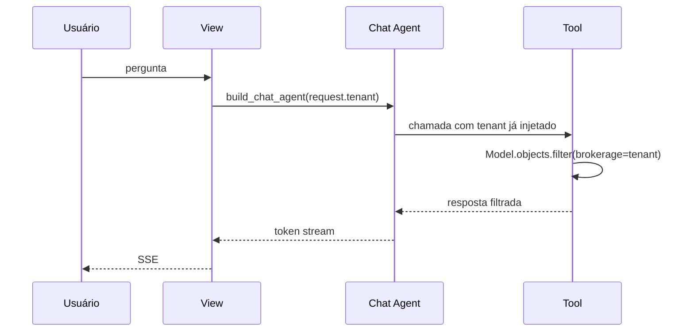

# Agentes de IA

O Brokerly usa LangChain e LangGraph para resumos de entidades e chat com
tool-calling. A regra central é segurança por tenant: tools recebem a corretora
do servidor e nunca aceitam `brokerage_id` vindo do modelo ou do cliente.

## Componentes

| Arquivo/app | Papel |
|---|---|
| `ai_agents/tools.py` | Tools tenant-scoped para entidades e chat. |
| `ai_agents/agent.py` | Factories de agentes LangGraph. |
| `ai_agents/prompts.py` | Prompts em pt-BR. |
| `ai_agents/tasks.py` | Resumos assíncronos por Celery. |
| `ai_agents/views.py` | Endpoints de resumo, chat e SSE. |
| `ChatSession` | Conversa persistente por usuário e tenant. |
| `ChatMessage` | Mensagens user/assistant/tool/system. |

## Fluxo de tool-calling seguro



## Resumos por entidade

Resumos são disparados por endpoint, enfileirados no Celery e gravados na própria
entidade.

| Entidade | Campos de resumo |
|---|---|
| Cliente | `ai_summary`, `ai_summary_status`, `ai_summary_updated_at` |
| Proposta | Mesmos campos |
| Apólice | Mesmos campos |
| Sinistro | Mesmos campos |
| Negociação | Mesmos campos |

## Chat

O chat mantém sessões por usuário. A view valida que a sessão pertence ao
`request.user` e ao `request.tenant`; falhas retornam 404 para não revelar
existência de sessão alheia.

## Streaming

As respostas são enviadas por `StreamingHttpResponse` com `text/event-stream`.
Cada chunk segue o formato:

```json
{"type": "token", "content": "texto"}
```

Ao final:

```json
{"type": "done", "message_id": 123}
```

## Tools disponíveis

| Categoria | Exemplos |
|---|---|
| Clientes | Busca e resumo de carteira por cliente. |
| Apólices | Listagem, filtros por status/ramo e resumo de carteira. |
| Propostas | Listagem e agregação por status. |
| Sinistros | Listagem e contagem por status. |
| CRM | Funil e negociações por estágio. |
| Carteira | KPIs gerais do tenant. |

## Custos e latência

O projeto usa GPT-5.5-mini por ser o modelo definido no PRD para equilíbrio entre
custo e qualidade. Resumos rodam de forma assíncrona; chat limita histórico para
evitar contexto infinito.

!!! note "Estimativa operacional"
    O custo depende de tokens de entrada, ferramentas chamadas e tamanho da
    resposta. Monitore uso real pela plataforma da OpenAI e pelo volume de tasks.

## Falhas

| Situação | Tratamento |
|---|---|
| `OPENAI_API_KEY` ausente | SSE ou task retorna erro amigável. |
| Timeout | Status de erro persistido. |
| Tool sem dado | Resposta deve dizer que não encontrou dado. |
| Cross-tenant | Query retorna vazio ou view retorna 404. |

## Regras de segurança

1. Nunca aceitar `brokerage_id` em tool.
2. Nunca deixar o LLM escolher tenant.
3. Filtrar toda query por `brokerage`.
4. Limitar histórico do chat.
5. Persistir erros sem vazar segredos.
