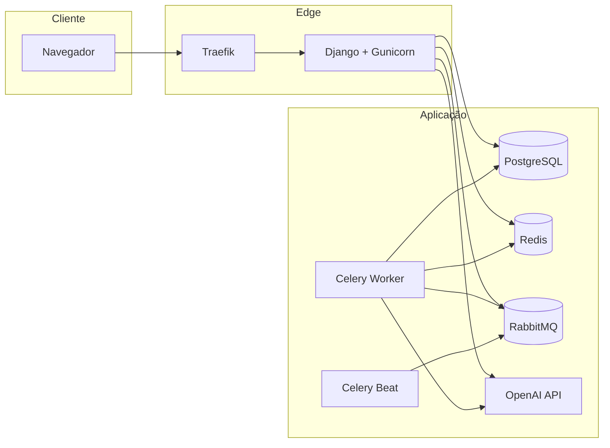

# Arquitetura

O Brokerly é uma aplicação Django monolítica modular, com apps por domínio e
infraestrutura separada para banco, broker, cache e workers. A arquitetura busca
paridade entre desenvolvimento e produção, sempre com PostgreSQL e isolamento por
tenant.

!!! note "Escopo"
    Esta página resume a arquitetura de aplicação, serviços de apoio e fluxo de
    deploy. Detalhes operacionais aparecem em [Deploy](deploy.md).

## Componentes principais



## Organização Django

| Pasta/app | Papel |
|---|---|
| `core` | Settings, URLs, Celery, WSGI e views transversais. |
| `base` | Modelos abstratos, managers e mixins compartilhados. |
| `accounts` | Usuário customizado, login por e-mail e roles. |
| `tenants` | Corretora, plano, assinatura e middleware de tenant. |
| `clients`, `insurance`, `claims` | Núcleo operacional de seguros. |
| `commissions`, `partners`, `renewals` | Financeiro, hierarquia comercial e renovações. |
| `crm` | Pipeline, etapas, negociações e histórico de estágio. |
| `ai_agents` | Resumos, chat, prompts e tools tenant-scoped. |
| `dashboard`, `reports` | Visão analítica e exportações PDF/CSV. |
| `documents`, `notifications` | Arquivos protegidos e notificações internas. |

## Fluxo request/response

1. O navegador acessa Django via Traefik/Gunicorn.
2. A autenticação identifica o usuário.
3. `TenantMiddleware` define `request.tenant`.
4. Views privadas filtram por tenant com mixins ou queries explícitas.
5. Templates renderizam apenas dados do tenant atual.
6. Tarefas demoradas retornam rápido e continuam no worker.

## Serviços de apoio

| Serviço | Uso |
|---|---|
| PostgreSQL | Fonte de dados relacional, constraints, JSONB e índices compostos. |
| RabbitMQ | Broker de mensagens para Celery. |
| Redis | Cache e backend auxiliar de resultados. |
| Celery Worker | PDFs, resumos por IA, notificações e tarefas pesadas. |
| Celery Beat | Agendamentos recorrentes via banco. |
| Traefik | TLS, roteamento, health checks e proxy de produção. |

## Desenvolvimento local

O Docker Compose sobe os mesmos serviços essenciais da produção. O código é
montado em volume para iteração rápida, e o app usa `runserver` em vez de
Gunicorn. O banco continua sendo PostgreSQL.

```bash
docker compose up -d --build
docker compose exec app python manage.py migrate
docker compose exec app python manage.py createsuperuser
```

## Produção

Em produção o projeto usa Docker Swarm. O app roda com Gunicorn, Traefik faz TLS
via DNS-01 e os workers ficam em serviços separados. Migrations no serviço `app`
usam advisory lock do PostgreSQL para evitar corrida entre réplicas.

!!! warning "Swarm não respeita depends_on"
    A ordem real de prontidão é tratada por healthchecks, `wait_for_db`,
    `restart_policy` e entrypoints idempotentes.

## Decisões importantes

- Não há SQLite em nenhum ambiente.
- Não há schema por tenant; o isolamento é por FK `brokerage`.
- WhiteNoise serve arquivos estáticos coletados.
- Mídia protegida é sempre entregue por views autenticadas.
- IA usa tools com tenant injetado pelo servidor.

## Riscos arquiteturais

| Risco | Mitigação |
|---|---|
| Vazamento entre tenants | FK obrigatória, middleware, mixins, validação e revisão de queries. |
| N+1 em telas analíticas | `select_related`, `prefetch_related`, `annotate` e `aggregate`. |
| Fila assíncrona travada | Result backend, painel Celery, logs e notificações. |
| Deploy concorrente | Advisory lock nas migrations e rollout com rollback. |
