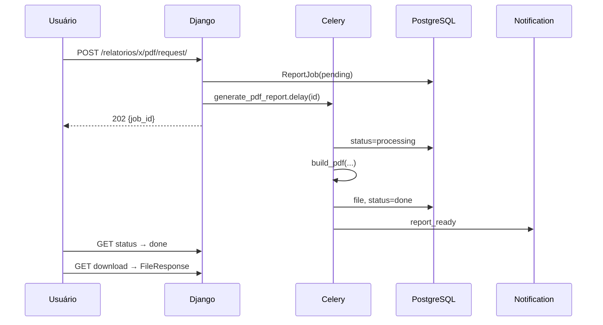

# Tarefas Celery

O Brokerly usa Celery para mover trabalho pesado para fora do request/response.
Resumos por IA, PDFs de relatórios, notificações e tarefas periódicas devem
rodar no worker, com RabbitMQ como broker e Redis/Django DB para resultados.

## Serviços

| Serviço | Papel |
|---|---|
| RabbitMQ | Broker AMQP. |
| Redis | Cache e backend auxiliar. |
| Celery Worker | Executa jobs assíncronos. |
| Celery Beat | Agenda tarefas periódicas. |
| Django Admin | Visualização via `dj-celery-panel` e results. |

## Lifecycle de PDF de relatório



## Tarefas conhecidas

| Task | Origem | Resultado |
|---|---|---|
| `ai_agents.summarize` | Resumo por IA | Atualiza entidade e notifica usuário. |
| `reports.generate_pdf_report` | Relatórios | Salva PDF e cria notificação. |
| Beat scheduler | Banco | Agenda futura para rotinas periódicas. |

## Padrão de UX

1. Usuário clica em ação pesada.
2. View cria registro de controle.
3. View retorna `202` ou mensagem de “você será notificado”.
4. Worker processa.
5. Notificação in-app informa sucesso ou erro.

## Estados de jobs

| Status | Significado |
|---|---|
| `pending` | Criado e aguardando worker. |
| `processing` | Worker iniciou o processamento. |
| `done` | Resultado gerado com sucesso. |
| `error` | Falha persistida para consulta. |

## Configuração relevante

```python
CELERY_BROKER_URL = env('CELERY_BROKER_URL')
CELERY_RESULT_BACKEND = 'django-db'
CELERY_RESULT_EXTENDED = True
CELERY_TASK_TRACK_STARTED = True
CELERY_BEAT_SCHEDULER = 'django_celery_beat.schedulers:DatabaseScheduler'
```

## Operação local

```bash
docker compose logs -f celery_worker
docker compose logs -f celery_beat
docker compose exec app python manage.py shell
```

## Falhas comuns

| Sintoma | Causa provável | Ação |
|---|---|---|
| Task não executa | Worker parado | Ver logs e reiniciar serviço. |
| Task fica pending | Broker indisponível | Checar RabbitMQ. |
| Resultado não aparece | Result backend/config | Conferir migrations de results. |
| PDF sem arquivo | Exceção no generator | Ver `error_message` do job. |

## Boas práticas

- Não executar IA, PDF ou e-mail no request.
- Persistir status antes de iniciar trabalho.
- Salvar erro curto e seguro.
- Criar notificação no sucesso e em falhas importantes.
- Não logar segredos.
- Usar retries apenas quando houver ganho real.
