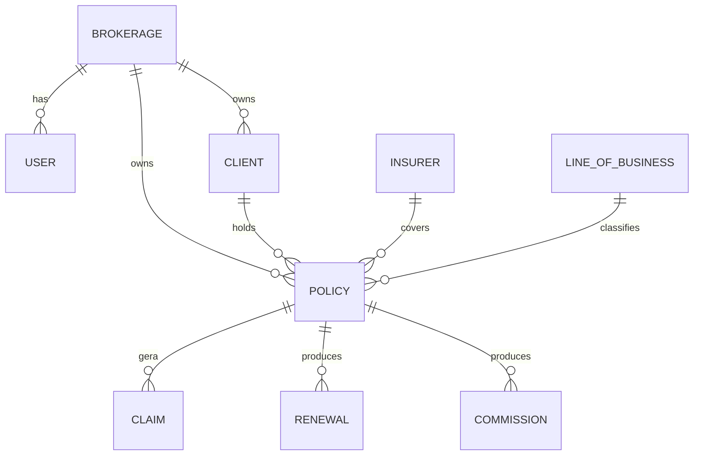

# Modelo de Domínio

O domínio do Brokerly cobre a operação completa da corretora: cadastro de
clientes, propostas, apólices, sinistros, renovações, CRM, comissões, parceiros,
anexos, notificações e IA. A corretora (`Brokerage`) é a raiz de isolamento.

## ER simplificado

## Núcleo de tenant

| Entidade | Papel |
|---|---|
| `Brokerage` | Corretora/tenant. |
| `Plan` | Plano comercial com limites e features. |
| `Subscription` | Assinatura ativa da corretora. |
| `User` | Login, e-mail e role operacional. |

## Clientes

`Client` representa PF ou PJ. Ele guarda documento, contato, endereço, status
ativo e campos de resumo por IA. É a entidade central para propostas, apólices e
sinistros.

| Campo | Observação |
|---|---|
| `person_type` | PF ou PJ. |
| `document` | Único por corretora. |
| `is_active` | Soft delete operacional. |
| `ai_summary*` | Resumo assíncrono e status. |

## Catálogo de seguros

`Insurer` representa seguradora e `LineOfBusiness` representa ramo. Ambos são
tenant-scoped para permitir cadastros próprios por corretora.

## Propostas e apólices

`Proposal` registra a intenção comercial antes da emissão. `Policy` representa a
apólice emitida, com vigência, prêmio, comissão e status.

| Entidade | Status principais |
|---|---|
| `Proposal` | Rascunho, enviada, em análise, aprovada, recusada, convertida. |
| `Policy` | Ativa, cancelada, expirada, renovada. |

## Itens cobertos

`CoveredItem` pode pertencer a uma proposta ou a uma apólice, nunca aos dois ao
mesmo tempo. Ele usa JSON para atributos específicos por tipo de seguro.

!!! note "Modelagem flexível"
    Automóvel, imóvel, frota, viagem, vida e equipamento compartilham a mesma
    tabela, com `attributes` e `coverages` para dados heterogêneos.

## Sinistros

`Claim` pertence a uma apólice e a um item coberto. Guarda data de ocorrência,
data de aviso, status, valor reclamado e valor aprovado.

## Endossos e renovações

Endossos registram mudanças na apólice. Renovações acompanham o ciclo de
vencimento e eventual criação de nova apólice.

## Parceiros comerciais

| Entidade | Uso |
|---|---|
| `Agent` | Agente comercial, opcionalmente ligado a usuário. |
| `Producer` | Produtor direto ou subordinado a um agente. |

## Comissões

`Commission` é ligada a uma apólice e guarda o valor devido pela seguradora.
`CommissionSplit` distribui repasses para agente ou produtor, sempre com validação
de tenant.

## CRM

| Entidade | Papel |
|---|---|
| `Pipeline` | Funil comercial da corretora. |
| `Stage` | Etapas ordenadas, com flags de ganho/perda. |
| `Deal` | Negociação vinculada a cliente, produtor, seguradora e ramo. |
| `DealStageHistory` | Histórico de movimentações no funil. |

## Entidades de suporte

- `Document`: anexo protegido ligado genericamente a uma entidade.
- `Notification`: notificação in-app para tarefas, renovações, relatórios e IA.
- `ChatSession` e `ChatMessage`: histórico do chat com IA.
- `ReportJob`: geração assíncrona de PDFs de relatórios.

## Regras de modelagem

1. Entidades sensíveis herdam `TenantAwareModel`.
2. Datas usam `DateField` ou `DateTimeField` com timezone.
3. Dinheiro usa `DecimalField(max_digits=14, decimal_places=2)`.
4. Percentuais usam `DecimalField(max_digits=6, decimal_places=4)`.
5. Exclusão física só acontece onde não compromete auditoria.
