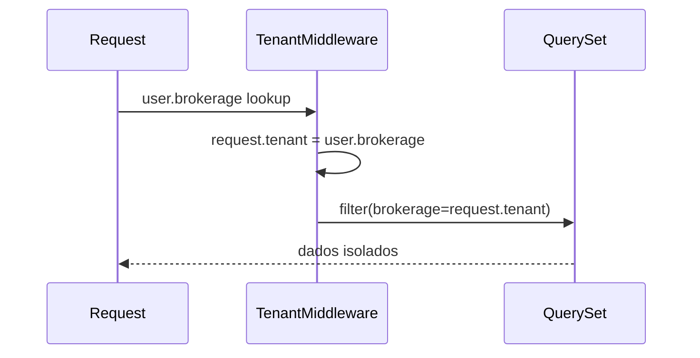

# Multi Tenant

O Brokerly usa shared schema com FK obrigatória `brokerage` nas entidades de
domínio. O isolamento é uma regra de segurança, não uma convenção opcional: toda
query sensível precisa restringir dados à corretora atual.

!!! warning "Regra inviolável"
    Qualquer endpoint que retorne dados de domínio sem filtro por tenant é bug
    crítico de segurança.

## Estratégia

| Decisão | Descrição |
|---|---|
| Modelo | Shared schema, uma base PostgreSQL e FK `brokerage`. |
| Escopo | `request.tenant` é resolvido a partir de `request.user.brokerage`. |
| Views | Views privadas filtram por tenant. |
| Forms | FKs selecionáveis são filtradas por tenant. |
| IA | Tools recebem `brokerage` por closure no servidor. |
| Arquivos | Caminhos segregados e download protegido por view. |

## Fluxo do middleware



## Modelagem

Entidades sensíveis herdam `TenantAwareModel`, que adiciona `brokerage` e mantém
o padrão de timestamps vindo de `BaseModel`.

```python
class Client(TenantAwareModel):
    name = models.CharField(max_length=200)
```

## Views

Para CBVs, use `TenantQuerysetMixin` quando houver queryset padrão. Em views
customizadas, filtre manualmente.

```python
def get_queryset(self):
    return super().get_queryset().filter(brokerage=self.request.tenant)
```

## Forms

Campos de FK nunca podem listar dados de outra corretora. Ao receber `tenant`,
ajuste cada queryset.

```python
self.fields['insurer'].queryset = Insurer.objects.filter(brokerage=tenant)
```

## Validação cruzada

Models com FKs para outras entidades tenant-scoped validam que todos os objetos
pertencem à mesma corretora. Isso protege contra payloads forjados e contra bugs
em views.

| Camada | Defesa |
|---|---|
| Middleware | Define `request.tenant`. |
| Manager/mixin | Filtra querysets. |
| Forms | Filtra escolhas por tenant. |
| Model `clean()` | Rejeita FKs de outro tenant. |
| Banco | Constraints únicas compostas por `brokerage`. |

## Constraints únicas

Campos de negócio não são únicos globalmente. Um CPF, número de apólice ou nome
de pipeline só pode ser único dentro da corretora.

```python
models.UniqueConstraint(
    fields=['brokerage', 'document'],
    name='client_unique_document_per_brokerage',
)
```

## IA e tenant

O modelo de linguagem nunca recebe ou escolhe `brokerage_id`. A view cria o
agente com `request.tenant`, e as tools fecham esse valor em closure.

!!! note "Ferramentas seguras"
    A assinatura pública das tools deve aceitar filtros de negócio, não tenant.
    O tenant vem do servidor.

## Anexos e mídia

Arquivos ficam associados ao tenant e ao objeto pai. A view de download valida o
documento e o objeto relacionado antes de abrir o arquivo.

## Checklist de revisão

- [ ] A view é privada quando retorna dados de domínio?
- [ ] A query filtra por `brokerage=request.tenant`?
- [ ] FKs do form foram filtradas por tenant?
- [ ] `clean()` protege relações entre tenants?
- [ ] Constraints únicas incluem `brokerage`?
- [ ] Tool de IA não aceita `brokerage_id`?
